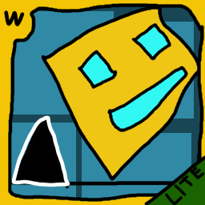

# shoddy gd server

welcome to the repo of the worst geometry dash server *known to man*

i mean you can browse play like and "rate" levels and you can upload levels but for some reason every level appears as uploaded by unknown and you cant delete them so uhh yeah.

it uses sqlite3 for its database and i mean i *did* code it in js but the routes have the .php so the game can actually talk with the server but dont be fooled into thinking its php lol

# tested versions
- 1.0
- 1.1

# setting up
``git clone`` the repo then run ``npm install`` and then after that run ``node src/geometry.js``

# known issues
- you cant even delete levels this server SUCKS man
- pressing the update icon crashes 1.0 (cant tell if this is with the game or server)
- names show up as "Unknown" on uploaded levels
- i think difficulty rating is broken aswell

# credits
robtop for making the funny cube game

[GMDprivateServer](https://github.com/Cvolton/GMDprivateServer) where i ~~stole~~ inspired some code from